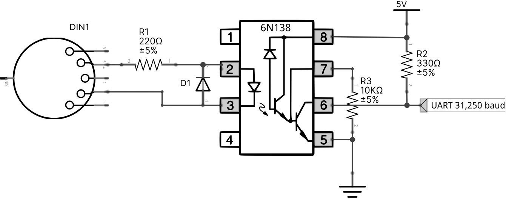
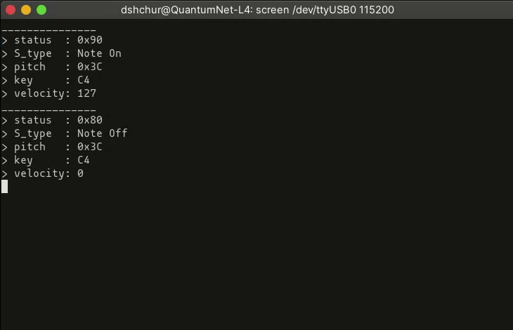
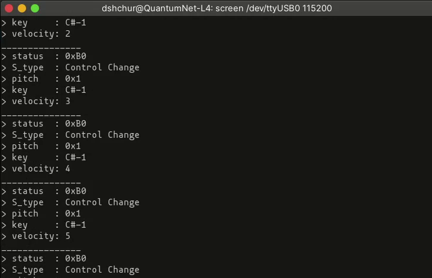
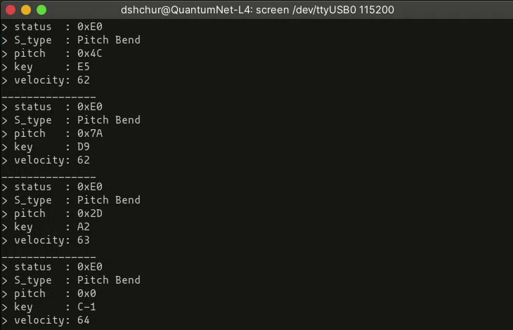
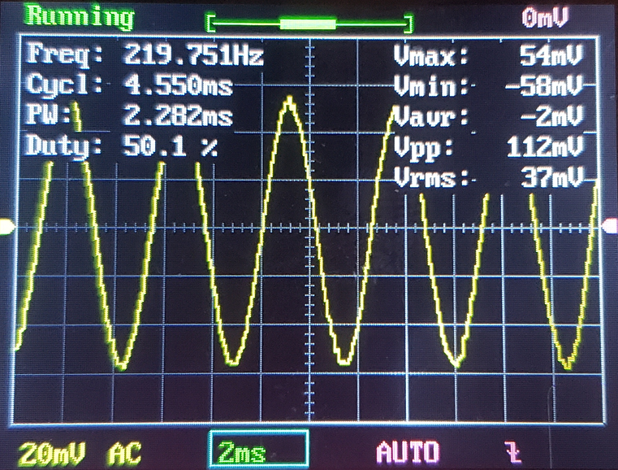
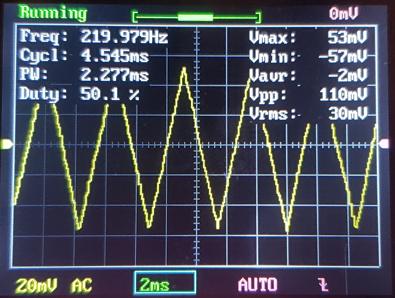
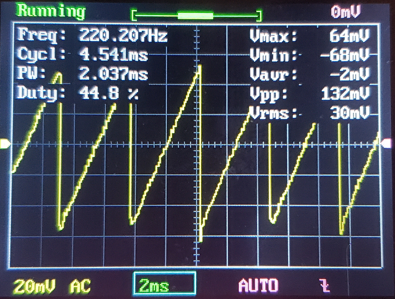
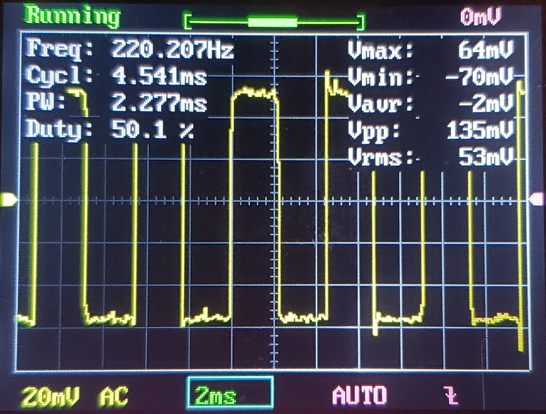
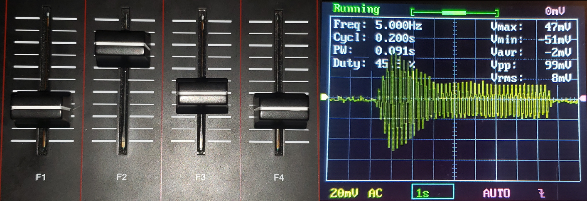
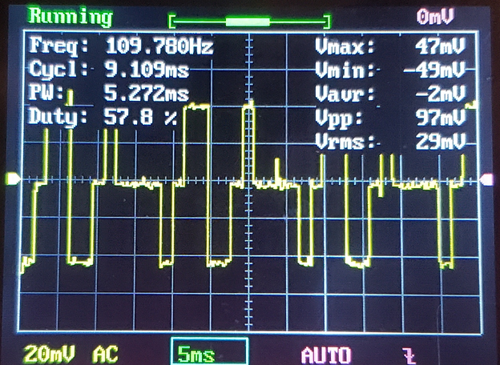

***S K R A C H***

An FPGA MIDI Synthesizer

**by  
Daniel Shchur**

A Technical Report Submitted to the Faculty of the  
Department of Computer Science and Engineering  
University of Nebraska–Lincoln

Submitted in partial fulfillment for the requirements of  
CSCE 436–Advanced Embedded Systems  
May 3rd, 2020

# Introduction/Foreword

CSCE436 is an advanced embedded systems class aimed at teaching students
advanced techniques for designing embedded systems that accomplishes
specific goals or solving problems. The class centers around the use of
FPGAs with hardware design in VHDL, designing solutions in hardware
rather than using higher level programming in micro controllers. As an
extension of the FPGA, softcores are also used such as the MicroBlaze
microprocessor. The final assignment of the class was to explore a topic
and engineer a solution to a student’s topic.

I chose to explore digital synthesis of sound and its application in
music: creating oscillators and interfacing with external controllers
that utilize the MIDI protocol. Personally, I’ve always been curious as
to what goes into creating a proper synth, having worked with many
virtual synthesizers over the years. In the context of the report, I am
an engineer who works at Shchur-Good (a company I may actually register
or even open).

# Design Goals

These are the initial design goals developed at the start of the
project. As the project progressed, some initial ideas changed and were
even thrown out all together due to time constrains or difficulty.

## Need Statement

Shchur-Good, a tech startup, is looking to develop a synthesizer module
not dissimilar to classic systems such as the Moog, Yamaha DX7, and Korg
synths. In this case, instead of a built in keyboard, as many classical
synths used, the system will be controlled via MIDI protocol, allowing
for agnostic control over the synth.

## Marketing Requirements

The basic requirements of the Skrach Synth are as follows:

  - Generate signals such as a sine, triangle, square, and saw,
    outputting samples as audio.

  - Interface with controllers over MIDI protocol using a standard 5 pin
    MIDI connector, allowing for receiving of control signals.

  - Modulate the pitch of the signals generated by the synth using MIDI
    note events generated by a controller.

  - Print debug info as well as allow for control using serial console
    over UART.

Advanced requirements are as follows:

  - Interface with control elements such as nobs, faders, and pads on a
    MIDI device to control the system.

  - Add filters, effects, and envelopes to the generated signals to
    allow for even more sound characteristics.

  - Modify the characteristic of the signal via frequency modulation
    like the mentioned commercial synthesizers.

  - Use audio input as a signal to modulate, similar to vocoder systems,
    also implemented in some commercial synthesizers.

Future ideas which are not requirements:

  - Video output showing an interface that shows the state of Skrach,
    especially the shape of the signal being output through the system
    and levels and settings of the synth.

  - MIDI Clock sync so that you can use multiple MIDI devices on the
    same synth, or synchronize sequencer functionality with controllers.

## Level-0 Design

*Fig 1: Level 0 diagram showing I/O and initial system
overview*

|   Module | Skrach Synth                                                           |
| -------: | :--------------------------------------------------------------------- |
|   Inputs | Serial control over UART (USB)                                         |
|          | 5 pin MIDI input for control input from MIDI devices                   |
|          | *Advanced*: Audio input via Mic or Line In                             |
|  Outputs | Audio of the signal being generated on Line Out                        |
|          | Debug information on serial console over UART                          |
|          | *Future*: Video showing state of the system and signal being generated |
|          | *Future*: MIDI Out for clock sync and other related settings/functions |
| Behavior | 1\. Startup generates basic sine wave and output to audio.             |
|          | 2\. Use switches to change type of signal (sine, square, etc)          |
|          | 3\. MIDI signals from MIDI peripheral maps to certain functionality in |
|          | synth, namely keyboard keys to pitch of the signal                     |

Level-0 Functionality

# Detailed Design

As more thought was put into the system and the concepts researched, an
initial detailed design was created.

## Level-1 Description

The keyboard depicted in the figure is the MIDI controller being used
for testing of the system. As such, some functionality may be programmed
to better suit the particular keyboard’s implementation of the MIDI
protocol.

The MIDI circuit is credited to MIDI.org, the organization which
oversees the development of the protocol.

*Fig 2: Level 1 user interaction graphic*

## Datapath and Control

Within the Skrach Core there are 12 operators which are instantiated and
mixed together using as single mixer instance. The diagram is simplified
in that respect.

*Fig 3: Skrach block diagram*

The major control pieces are the UART control for user input, and also
MIDI control which also works over UART. (control)

Both feed into the MicroBlaze which will then control the synth module
(datapath), modifying frequency, amplitude, and sound shape for output.

## Calculations

### Synth Module

The synth module will implement look up tables with phase accumulation
to be able to change frequency. This will involve a Q9.7 phase signal to
do step changes in indexing. Interpolation may be implemented to help
make the signal more accurate; however, at higher sample counts, it may
not be all that necessary.

Once more research is done on how to perform FM Synthesis, that too will
be implemented using low frequency oscillators to modulate the carrier
signal (main output). This may involve the addition and multiplication
of sample data.

A filter and envelope system will also be implemented that allows for
control of the signal’s output in amplitude. This will entail the
multiplication of signals as well.

### MIDI Controller

The MIDI controller doesn’t have much for calculation other than
decoding the UART signal as it comes it. The signal is an 8 bit scan
code control signal signifying changes on the MIDI Device with a start
and stop bit, meaning a total of 10 bits per control element.

A state machine will have to be devised to read this properly and
accurately. Either that, or an already available UART controller such as
the UART Lite modified to work with the MIDI protocol.

### MicroBlaze

For control, once scan codes are decoded from MIDI, the phase should
change depending on what key was pressed. A popper frequency needs to be
calculated and output as control to the synth module in the form of a
Q9.7 phase value.

This can be summed up in the following equation:

*Φ = N\*f / F**s* ...(1)

Where *Φ* is the phase, *N* is the number of samples per period, *f* is
the desired frequency, and *F**s* is the audio sampling
frequency.

When reading from the synth the phase and converting to frequency, the
equation can be rearranged such that *f* is on the left hand side, and
*Φ* is on the right.

Another equation to consider is what frequency corresponds to what
keyboard key as dictated by a standard 88 key piano. A suitable equation
was found online in the context of the MIDI protocol (Wolfe, n.d.):

*f = 2**(m-69)/12**(440)* ...(2)

Where *f* is the desired frequency and *m* is the midi key assuming the
note *A*4 is at 440Hz.

## Technical Requirements

Similar to the marking requirements, theses are the basic requirements
that need to be met to be able to achieve the design goals:

  - Ability to receive and properly decode MIDI signal allowing 88 keys
    of input as well as some basic control elements such as faders and
    knobs.

  - With MIDI input, allow for basic polyphony of input, meaning
    multiple inputs can be handled at once, but not necessarily in sound
    (be able to hold a note down while changing the volume of sound).

  - Ability to print the status of the system over UART to a console as
    well as allow user input to control aspects of the synth module.

  - Output a 16bit 48kHz audio signal so that the system is a fairly
    high fidelity in terms of audio output.

## Bill of Materials

There are 3 major pieces to this project:

  - Nexys Video FPGA

  - MIDI Input Circuit (optocoupler, diode, MIDI connectors)

  - MIDI Controller such as a keyboard (AKAI MPK249)

# Implementation

This section covers the process of implementing the technical
requirements outlined in the previous section.

## Milestone I

By the deadline, only the circuit had been built and tested through a
logic analyzer that did decode. After spending some more time the
following day, MIDI decode of status, pitch, and velocity through the
MicroBlaze system was achieved. More work needed to be done to be able
to implement more controller functionality so that things like faders
and knobs can also be properly used. A data structure also had to be
implemented to be able to easily and properly pass around MIDI events
within the processor.

### Unit Test Plan

The MIDI circuit first needed to be build and then made sure
operational. For this, a breadboard and alligator clips was used to
connect the circuit to the MIDI interface on the MIDI controller. The
circuit was then connected to a logic analyzer and modified until proper
communication was achieved. Once the circuit was working, components
were cut in length to reduce possibility of shorts and wires were
soldered to the MIDI connector to maintain good connection. Had there
been access to a through-hole prototyping PCB, all the components would
have been soldered together to prevent shorts and maintain proper
contacts in the circuit. Figures [4](#fig:midi_in_schematic),
[5](#fig:logic_key_down), and [6](#fig:logic_key_up) illustrate the
final circuit used, as well as logic analyzer results.

*(Fig 4: MIDI in schematic)*

 
*(Fig 5: Key down event)*

*(Fig 6: Key up event)*

After the MIDI circuit was deemed complete, a previous project
encompassing a MicroBlaze implementation was used as a starting point
and copied. The UARTLite IP Core was copied into the local IP repo and
edited to support the required baud rate of 31250. This new UARTLite was
then added and had its RX pin connected to a PMOD port on the FPGA. As
MIDI involves a 3 byte sequence, 3 calls to the UART read function were
called and the data was printed to console. Once reading of data was
tested, functions were written to start to decode the scan codes and map
them to user friendly names. These were input into enumerated types and
ultimately, a structure of 3 int variables was created to handle the
data as a packet involving a control word, pitch, and velocity, as
dictated by the MIDI protocol. By the second day after the deadline,
decode of essential MIDI messages was fully implemented and data printed
nicely to console. This is visible in figure the following figures:

*(Fig 7a: MIDI Decode note)*

*(Fig 7b: MIDI Decode control)*

*(Fig 7c: MIDI decode pitch)*

## Milestone II

The goal for this milestone was to reuse a previous signal generator
design from previous assignments and retrofit it to be controlled by
MIDI.

The previous assignment IP was modified, removing hardware control since
the system was begin controlled by the MicroBlaze. Control of the IP was
implemented within the MicroBlaze, implementing equation 1 for the required phase for the signal
generator as well as equation 2 for
MIDI. However, the inclusion of the IP block into the block design broke
UART communication, this also includes the module related to MIDI
reading. Because of the circumstances, the implementation was not able
to be tested.

## Final Implementation

In summary, the final implementation was able to do the following:

  - Read a MIDI device and decode MIDI messages.

  - Generate a signal of type sine, triangle, saw, and square,
    implementing an oscillator.

  - Modulate that signal using an amplitude envelope implementing
    attack, decay, sustain, and release (ADSR).

  - Mix multiple signals together allowing for multiple oscillators to
    be combined, essentially allowing for polyphony.

  - Modulate overall signal amplitude (volume).

  - Output that signal using the audio codec at 48kHz sampling rate and
    16bit width samples.

  - Change pitch of oscillator using the data given by a MIDI note
    event.

  - Start and stop playback of an oscillator upon receiving note on/off
    events.

  - Adjust the ADSR envelope using MIDI control.

  - Switch signal type using MIDI control.

  - Play up to 12 notes at a time.

Some advanced functionalities such as frequency modulation and filters
were not achieved due to lack of time. One basic requirement was also
not achieved due to the complexity of doing so, which is UART control.
Since there are two UART controllers in the system, either the MIDI or
USB could be polled, but not both. This would have required setting one
up on an interrupt system, and that was not able to be achieved
properly.

The modules are explained in the following sub-sections:

### Operator

An operator consists of an oscillator and ADSR where the oscillator
feeds directly into the ADSR, and ADSR feeds out.

#### Oscillator

The oscillator is a signal generator, not dissimilar to that which had
been created for a previous assignment, that can generate a sine,
triangle, saw, and square wave. The frequency that is generated is
determined by a phase accumulator which changes the step size of the
system. The phase value is implemented as a Q9.7 fixed point value which
allows for fine grained control of the frequency with a minimum of about
.35Hz and maximum of 24kHz. The sine wave is stored as 16-bit samples in
a 2048 address 36kb block of BRAM. A counter steps through the BRAM
according to the phase value. The saw wave is simply the output of the
address counter. The square wave is a mux which outputs the minimum
value of a signed 16 bit signal while the counter is below 1024, and
then maximum when the counter is above. Similar to the saw wave, the
triangle is generated by doubling the address counter and negating it
after 1024. No linear interpolation is performed.

The signals were confirmed using an oscilloscope as can be seen in the following figures:

*(Fig 8a: Sine wave)*

*(Fig 8b: Triangle wave)*

*(Fig 8c: Saw wave)*

*(Fig 8d: Square wave)*

#### Amplitude Envelope (ADSR)

An amplitude envelope is historically 4 variable system that dictates
the amplitude of something over time. Within the synth, it was
implemented with attack, decay, sustain, and release (ADSR). Attack,
decay, and sustain are timing values, while sustain is an amplitude
value. Attack corresponds to the amount of time it takes for the signal
to read full amplitude, decay to the amount of time it takes for the
signal to go from full amplitude to the level dictated by sustain, and
release the amount of time it takes to bring the amplitude to zero from
the level dictated by sustain (“Envelope (Music)” 2020).

It was implemented as a state machine where, upon being enabled, it
would start the attack and continue through to decay, and then sustain.
It would stay in sustain until it was no longer enabled, at which it
would go to release. If during release, it was enabled again, it would
jump to attack. If during attack, decay, or sustain it was disabled, it
would move to release.

Figures [9](#fig:adsr1) and [10](#fig:adsr2) show the amplitude of the
signals corresponding to values set by the MIDI controller where attack
is the left most fader, followed by decay, sustain, and release.

*Fig 9: ADSR 1*

*Fig 10: ADSR 1*

### Mixer

Given polyphony was to be implemented, there was a need for a module
that could add all the operators together without overflow of data
during addition, nor loss of amplitude. Since the human hand has 10
fingers, 12 operators were instantiated to cover all bases. The mixer
was built to have 12 inputs and output a single signal. It does so by
calculating how many extra bits are needed for the sum of all the
signals. This can be done by taking a log2 of the number of
signals added. Once this number is known, the signals are resized to the
new size, added together, and then the upper bits are taken. The final
signal is then multiplied by an amplitude value to allow for master
volume control. The multiplication is done within a DSP slice on the
FPGA to reduce the amount of logic and clock cycles needed to do the
multiplication.

The following figures show multiple signals being added
together.

*Fig 11a: Two sine waves*

*Fig 11b: Two square waves*

### Audio Codec

A large part of frustration in the assignment came from the audio codec.
In truth, it presents a complex problem that is experienced in many
modern hardware designs since it deals with the notion of multi-clock
domains.

To start, the audio codec on the Nexys Video FPGA is the Analog Devices
ADAU1761. It supports a wide variety of sample rates and up to 24bits of
data per sample. It can be set up using I2<\sup>C, and audio data is sent
over serial using I2<\sup>S. The original implementation used was one
that was given for previous assignments; however, it had a number of
issues, namely timing and setup. Because of this, the audio data was
distorted, containing an audible compression and crunch within the sound
on the output. Sample data was also sent one by one when needed as
dictated by the clocks generated for I2<\sup>S communication. While the
design worked for basic needs, because of the complexity of the
synthesizer, these timing issues propagated through the design which
created negative setup time issues during implementation, indicating
possible loss of data. Indeed, when running the implemented design, no
audio was being generated, even though sample data could be visible
using console debug. This led to a re-implementation of the audio codec
module.

The new design was actually based on an old one. Digilent had created a
set of example projects to test out and learn the Nexys Video FPGA. The
DMA project was used as reference and starting place for the changes
necessary to fix the audio codec design. Initially, the only thing that
was changed was the setup parameters as well as a flip flop cascade to
sync the L/R clock with the system clock to know when the next sample
was needed. This was implemented as a basic hardware project that had no
high level complexity. With loopback testing and then testing with the
Skarch Core, it was found that the new design produced a clean and loud
audio signal that was no longer distorted. Given the codec seemed to be
functioning as expected, the new design was put into placed and
compiled. However, negative setup time was still being created and there
was still no audio ouput when used in the MicroBlaze block design. This
meant more research of the problem was needed.

A realization occurred that the system is partitioned into multiple
clock domains. There was the system clock of 100 MHz and the audio codec
clock which was 12.288 MHz. This meant that there would be syncing and
phase issues between data, especially if the system was strained with
complex designs. Research was done to find methods to mitigate
cross-clock meta-stability issues and some methods were found such as
two flip flop synchornizers, handshakes, and FIFOs (EDN 2014). Upon
investigating what the team at Digilent had done, it was seen that their
design used an asynchronous FIFO system to mitigate the effects of the
meta-stability since it would allow the two clock domains to transfer
data at their own rates. These designs added quite a bit of complexity
to the design, so they were initially avoided. First, duel flip flop
synchronizers were tried to see if it would mitigate the problem. They
brought the negative slack down, but did not fix the problem. Next, the
clock generation for the audio codec was externalized since it’s
recommended to split the clock at one place instead of chaining clock
dividers. This again lessened the problem, but did not fix it. Then, a
set of FIFOs was implemented, but still, a considerable amount of
negative slack remained. Finally, what had fixed the problem was adding
in an asynchronous reset into the system since the reset provided by the
AXI bus is synced to the 100 MHz system clock. Doing this allowed the
bits that were clocked by the audio codec to meet timing requirements,
and indeed, this fixed the issue.

# Running the Project

Running the project is not exactly easy since it requires, aside from
the FPGA, a MIDI circuit and MIDI controller. However, if all three
components are available, then the project entails the following steps:

1.  Burn the Skrach Core bitstream onto the FPGA (this is due to a bug
    in the audio codec set up where first runs fails to generate audio
    output on the main project)

2.  Connect the MIDI circuit to pin 1 of the JC PMOD port

3.  Launch the SDK for the main project, if the sources aren’t found,
    import them (Skrach and Skrach_bsp under the Skrach.sdk folder)

4.  Compile, program FPGA with bitstream, and then run the program.

In a console window of 115200 baud rate, you should receive a welcome
message and then decode message from a MIDI controller if connected.
Notes will automatically cause the Skrach Core to play signals on Line
Out and Headphone jacks. Changing of signal type, master amplitude, and
ADSR values are mapped to the controls on my keyboard which can
correspond to different faders and knobs for different MIDI controllers.
This can be remapped in the synth file. There were plans to allow for
full control over USB UART, but that was not able to be implemented, so
it’s hard to test on the fly. However, debug prints can be uncommented
and MIDI messages can be constructed statically within code to test the
signal generator and code itself, as was done for easy testing early on.

Demos
============

- [Demo](vid/demo.mp4)
- [Improv 1](vid/improv1.mp4)
- [Improv 2](vid/improv2.mp4)
- [Doom](vid/doom.mp4)

- [youtube](https://www.youtube.com/watch?v=nMU6i0qCqv4)

References
============

EDN. 2014. “Synchronizer Techniques for Multi-Clock Domain Socs &
Fpgas.” EDN. EDN. September 2014.
<http://www.edn.com/synchronizer-techniques-for-multi-clock-domain-socs-fpgas>.

“Envelope (Music).” 2020. Wikipedia. Wikimedia Foundation. April 2020.
<https://en.wikipedia.org/wiki/Envelope_(music)>.

Wolfe, Joe. n.d. “Note Names, Midi Numbers and Frequencies.” Note Names,
MIDI Numbers and Frequencies. The University New South Wales.
<https://newt.phys.unsw.edu.au/jw/notes.html>.

