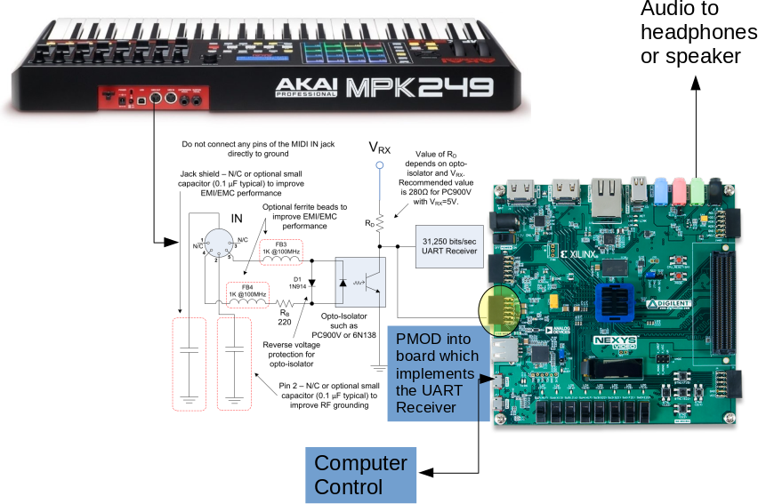

# Skrach - An FM Synthesizer
A final project milestone 1 report for CSCE 436 by Daniel Shchur

April 15, 2020

[TOC]

## Milestone I

My Monday April 13, I was only able to have gotten the circuit built and tested through a logic analyzer that did decode. After spending some more time Tuesday April 14, I was able to get it to read codes and decode status, pitch, and velocity through the MicroBlaze system, thus, more or less reaching a majority of Milestone 1 goals. However, more work needs to be done to be able to implement more controller functionality so that things like faders and knobs can also be properly used. A data structure also has to be implemented to be able to easily properly pass around MIDI events within the processor.

### Detailed Architecture

The architecture stays unchanged. After researching MIDI protocol more thoroughly, I found that it is simply built on top of UART, thus, implementing a UARTLite IP was suitable for this task.

#### Level-1 Description

#### Datapath and Control

The major control pieces are the UART control for user input, and also the MIDI control coming from a MIDI device which is also a form of user input.

Both feed into the MicroBlaze which will then control the synth module (datapath), modifying frequency, amplitude, and sound shape for output.

### Unit Test Plan

I had to first build the circuit and make sure it was operational. For this, I had decided to shoddily use a breadboard and alligator clips to connect the circuit to the MIDI interface on the MIDI controller. The circuit was then connected to a logic analyzer and modified until proper communication was achieved. Once the circuit was working, components were cut in length to reduce possibility of shorts and wires were soldered to the MIDI connector to maintain good connection. Had I owned a through-hole prototyping PCB, I would have soldered all the components together to prevent shorts and maintain proper contacts in the circuit. The following figures illustrate the final circuit used, as well as logic analyzer results.

*MIDI Schematic*

*Key Down Event*

*Key Up Event*

After all this was done, lab4 block design was modified to also have another UARTLite module involved for the MIDI decode and a function was written to read the midi signals and simply output the raw data to console. This was successful. The last test which was implemented most recently involved rebuilding the block design to be more suited to the project at hand, having more memory and a floating point unit to aid in division operations, a MIDI library was written to start to aid in the proper decode of the signals. Currently, status, pitch, and velocity are decoded properly for the piano keys on the MIDI controller, faders, knobs, and pitch bend are left to be implemented; however, they are not vital to the operation of the synth yet at user control over UART is one of the requirements. Screenshots of the system working were not taken and a bug in the current design (as of Wednesday April 15) prevents USB UART from being operational.